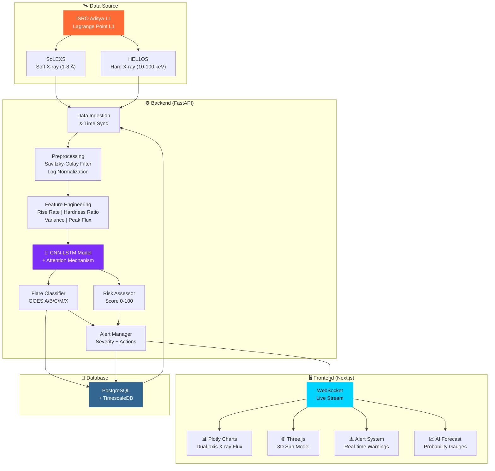
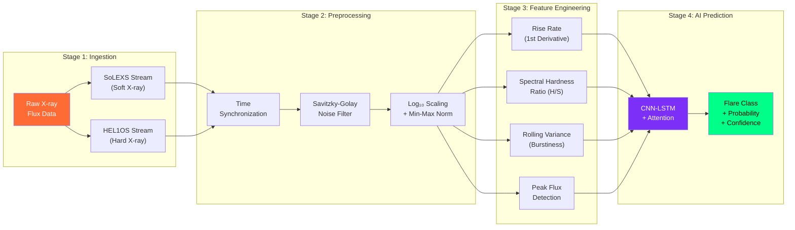
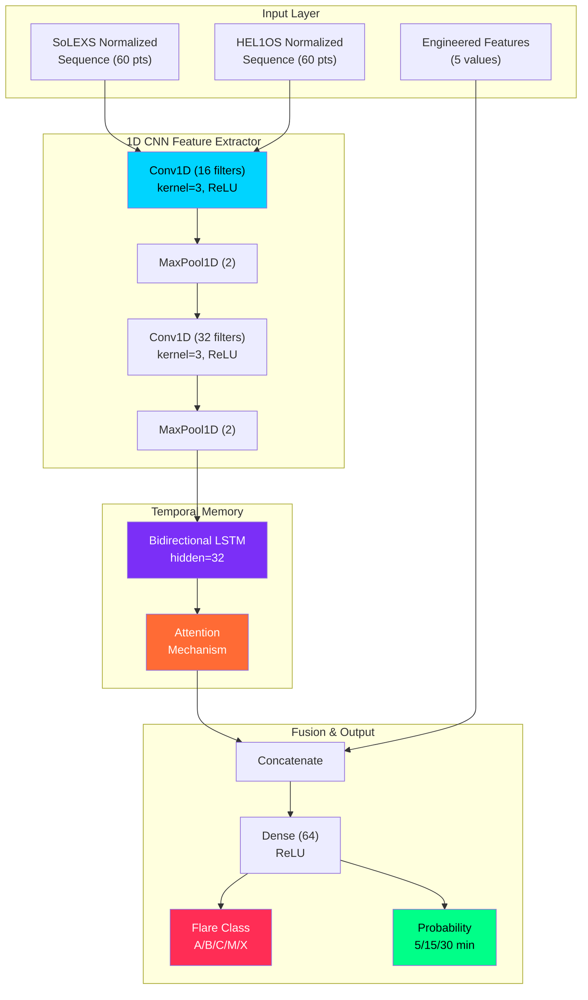
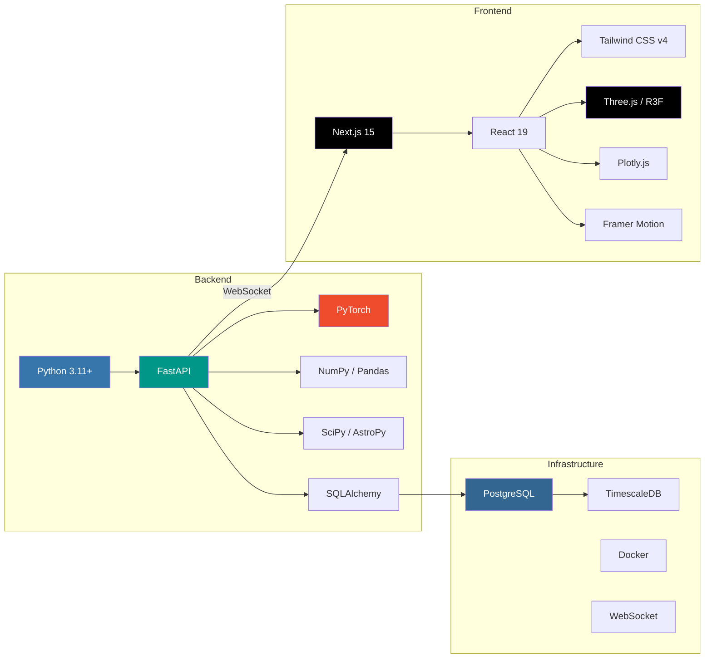
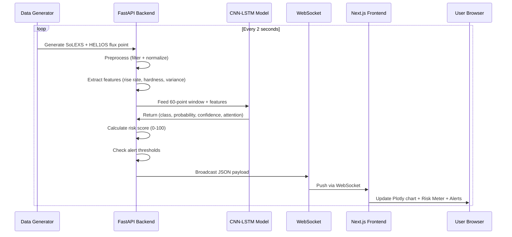

<div align="center">

# ☀️ SuryaShield AI

### *Predicting the Sun's storms before they strike Earth*

An AI-powered space weather early warning system built using **ISRO Aditya-L1** mission data.

[](https://python.org)
[](https://fastapi.tiangolo.com)
[](https://nextjs.org)
[](https://pytorch.org)
[](https://threejs.org)
[](https://tailwindcss.com)

</div>

---

## 📋 Table of Contents

- [Overview](#-overview)
- [System Architecture](#-system-architecture)
- [Data Pipeline](#-data-pipeline)
- [AI Model Architecture](#-ai-model-architecture)
- [Tech Stack](#-tech-stack)
- [Real-Time Data Flow](#-real-time-data-flow)
- [Web Application Pages](#-web-application-pages)
- [Getting Started](#-getting-started)
- [Project Structure](#-project-structure)
- [API Reference](#-api-reference)
- [Future Roadmap](#-future-roadmap)

---

## 🌍 Overview

**SuryaShield AI** combines Soft X-ray observations from **SoLEXS** and Hard X-ray observations from **HEL1OS** aboard ISRO's Aditya-L1 spacecraft to:

- **Nowcast**: Detect and classify solar flares in real time (GOES classification: A, B, C, M, X)
- **Forecast**: Predict the probability of a flare occurring in the next 5, 15, and 30 minutes
- **Alert**: Generate actionable warnings with lead times for satellite operators, airlines, and power grid managers

Solar flares can disrupt GPS navigation, satellite communications, aviation, and power infrastructure. Current systems often detect flares *after* they've started. SuryaShield AI identifies **precursor patterns** in X-ray data *before* the flare peaks.

---

## 🏗 System Architecture



---

## 🔬 Data Pipeline

The system processes raw X-ray flux data through a multi-stage pipeline before it reaches the AI model:



### How Each Stage Works

| Stage | Module | What It Does |
|-------|--------|-------------|
| **Ingestion** | `generator.py` | Generates realistic synthetic Aditya-L1 data (or reads real `.fits` files). Simulates baseline flux (~10⁻⁸ W/m²) with periodic C/M/X class flare events |
| **Sync** | `sync.py` | Time-aligns SoLEXS and HEL1OS streams to a common 2-second cadence |
| **Filter** | `preprocessor.py` | Applies Savitzky-Golay filter (window=11, poly=3) to remove instrumental noise while preserving flare signatures |
| **Normalize** | `preprocessor.py` | Log₁₀ scales the flux (which spans 10⁻⁹ to 10⁻³) then min-max normalizes to [0, 1] |
| **Features** | `feature_engine.py` | Extracts: rise rate (derivative), spectral hardness ratio (hard/soft), flux variance, and peak values |
| **Predict** | `cnn_lstm.py` | CNN-LSTM with Attention processes 60-point windows and outputs class + probability |

---

## 🧠 AI Model Architecture



### Why CNN-LSTM + Attention?

- **1D CNN**: Captures **short-term local patterns** — the sharp spikes and rapid changes in X-ray flux that indicate flare onset
- **Bidirectional LSTM**: Models **long-range temporal dependencies** — the slow buildup of energy over minutes before a flare erupts
- **Attention Mechanism**: Learns to **focus on the most important time steps** — typically the pre-flare precursor signals that human operators might miss

---

## 🛠 Tech Stack



| Layer | Technology | Purpose |
|-------|-----------|---------|
| **AI Engine** | PyTorch | CNN-LSTM model definition, training, and inference |
| **Data Science** | NumPy, Pandas, SciPy, AstroPy | Array ops, time-series, signal filtering, astronomical computations |
| **API Server** | FastAPI + Uvicorn | Async REST API + WebSocket for real-time streaming |
| **Frontend** | Next.js 15 + React 19 | Server-side rendered pages with App Router |
| **Styling** | Tailwind CSS v4 | Utility-first CSS with custom space theme tokens |
| **3D Visualization** | Three.js + React Three Fiber | Shader-powered 3D Sun model with animated corona |
| **Charts** | Plotly.js | Scientific dual-axis logarithmic X-ray flux plots |
| **Animations** | Framer Motion | Page transitions, alert entrances, gauge animations |
| **Database** | PostgreSQL + TimescaleDB | Time-series optimized storage for flux readings & events |
| **Deployment** | Docker + Docker Compose | Containerized full-stack orchestration |

---

## 📡 Real-Time Data Flow



### WebSocket Payload Structure

```json
{
  "type": "LIVE_DATA",
  "timestamp": "2026-06-21T18:04:48.951799Z",
  "flux": {
    "solexs": 1.067e-07,
    "helios": 7.327e-09
  },
  "forecast": {
    "predicted_class": "C",
    "probabilities": { "5_min": 0.50, "15_min": 0.40, "30_min": 0.30 },
    "confidence_score": 0.55,
    "attention_weights": [0.02, 0.03, ...]
  },
  "risk": { "score": 15.0, "level": "LOW" },
  "alert": null
}
```

---

## 🖥 Web Application Pages

| # | Page | Route | Description |
|---|------|-------|-------------|
| 1 | **Landing** | `/` | Cinematic hero with 3D Sun (Three.js shaders), animated star field, mission overview |
| 2 | **Live Dashboard** | `/dashboard` | Real-time Plotly charts, Risk Meter gauge, active alerts, solar statistics cards |
| 3 | **AI Forecast** | `/forecast` | 5/15/30-min prediction gauges, Explainable AI attention heatmap, precursor signals |
| 4 | **History** | `/history` | Searchable flare database, detail modals, event statistics |
| 5 | **Impact** | `/impact` | Severity matrix for Satellites, GPS, Aviation, Power Grids, Radio |
| 6 | **Research** | `/research` | CNN-LSTM architecture diagram, training details, confusion matrix, performance metrics |

---

## 🚀 Getting Started

### Prerequisites

- **Python 3.11+**
- **Node.js 18+**
- **npm**

### Quick Start (Recommended)

```bash
# Clone the repository
git clone https://github.com/SudiptaSanki/SuryaShield-AI.git
cd SuryaShield-AI

# Run both servers
run.bat
```

### Manual Setup

**Terminal 1 — Backend:**
```bash
cd backend
python -m venv venv
.\venv\Scripts\activate        # Windows
# source venv/bin/activate     # Linux/Mac
pip install -r requirements.txt
uvicorn app.main:app --reload
```

**Terminal 2 — Frontend:**
```bash
cd frontend
npm install
npm run dev
```

**Open:** [http://localhost:3000](http://localhost:3000)

### Docker Compose (Full Stack)

```bash
docker-compose up --build
```
This starts PostgreSQL + TimescaleDB, FastAPI backend, and Next.js frontend together.

---

## 📁 Project Structure

```
SuryaShield-AI/
├── backend/
│   ├── app/
│   │   ├── main.py              # FastAPI entry point + CORS + routers
│   │   ├── config.py            # Environment settings (Pydantic)
│   │   ├── api/
│   │   │   ├── realtime.py      # WebSocket endpoint (/ws/live)
│   │   │   └── forecast.py      # REST endpoints (/api/v1/*)
│   │   ├── data/
│   │   │   ├── generator.py     # Synthetic Aditya-L1 data generator
│   │   │   ├── preprocessor.py  # Savitzky-Golay filter + normalization
│   │   │   ├── feature_engine.py# Rise rate, hardness ratio, variance
│   │   │   └── sync.py          # SoLEXS ↔ HEL1OS time alignment
│   │   ├── models/
│   │   │   ├── cnn_lstm.py      # PyTorch CNN-LSTM + Attention model
│   │   │   └── inference.py     # Model loading + prediction pipeline
│   │   ├── services/
│   │   │   ├── flare_classifier.py  # GOES class mapping
│   │   │   ├── risk_assessor.py     # Composite risk score (0-100)
│   │   │   └── alert_manager.py     # Alert generation + actions
│   │   └── db/
│   │       ├── models.py        # SQLAlchemy ORM models
│   │       └── seed.py          # Historical data seeding
│   ├── requirements.txt
│   └── Dockerfile
│
├── frontend/
│   ├── src/
│   │   ├── app/                 # Next.js App Router pages
│   │   │   ├── page.tsx         # Landing (3D Sun hero)
│   │   │   ├── dashboard/       # Live monitoring
│   │   │   ├── forecast/        # AI predictions
│   │   │   ├── history/         # Flare database
│   │   │   ├── impact/          # Impact assessment
│   │   │   └── research/        # Model details
│   │   ├── components/
│   │   │   ├── three/           # SunModel.tsx (shader-based 3D Sun)
│   │   │   ├── charts/          # XRayFluxChart.tsx (Plotly)
│   │   │   ├── dashboard/       # RiskMeter, FlareAlert, SolarStats
│   │   │   └── layout/          # Navbar, SpaceBackground
│   │   └── hooks/
│   │       └── useWebSocket.ts  # Real-time data hook
│   ├── package.json
│   └── Dockerfile
│
├── docker-compose.yml           # Full stack orchestration
├── run.bat                      # One-click local launcher
└── README.md
```

---

## 📡 API Reference

### REST Endpoints

| Method | Endpoint | Description |
|--------|----------|-------------|
| `GET` | `/` | Welcome message |
| `GET` | `/health` | Health check |
| `GET` | `/api/v1/forecast/current` | Latest prediction |
| `GET` | `/api/v1/alerts/current` | Active alerts |

### WebSocket

| Endpoint | Protocol | Description |
|----------|----------|-------------|
| `/ws/live` | WebSocket | Live data stream (2s intervals) |

---

## 🔮 Future Roadmap

- [ ] Integration with real ISRO Aditya-L1 data feeds (`.fits` format via AstroPy)
- [ ] Train CNN-LSTM on historical GOES X-ray data for production-grade accuracy
- [ ] Transformer-based model for longer prediction windows (1-6 hours)
- [ ] Global space weather monitoring network integration
- [ ] Push notifications for satellite operators
- [ ] Mobile-responsive PWA version

---

<div align="center">

**Built with ❤️ for the future of space weather prediction**

*Protecting Earth's technological infrastructure from solar storms*

</div>
