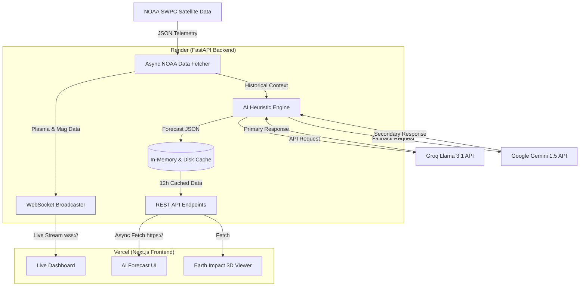
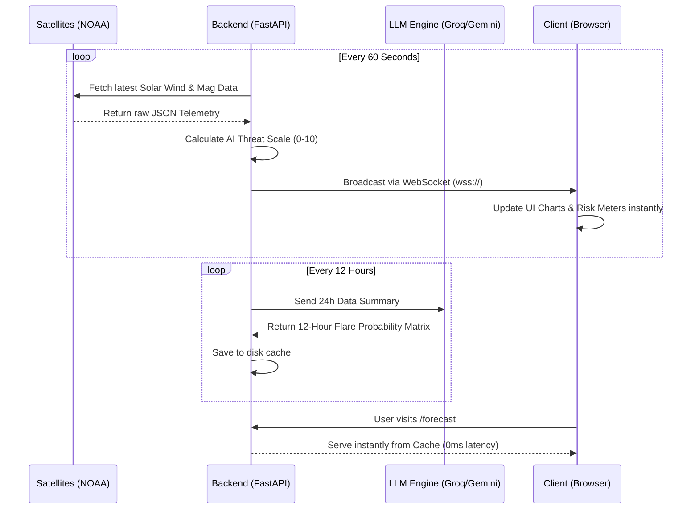

# SuryaShield AI - Presentation Content

This document contains all the requested materials for your hackathon pitch presentation, structured exactly according to your requirements. You can copy this content directly into your PPT slides.

---

## 1. Technologies to be used in the solution

**Frontend (Client-Side)**
- **Next.js (React 19)**: Framework for building the highly responsive, server-side rendered web application.
- **Tailwind CSS**: For rapid, utility-first UI styling with custom glassmorphism and cyberpunk aesthetic plugins.
- **React Three Fiber & Three.js**: For rendering high-fidelity, interactive 3D models of the Sun and Earth.
- **Framer Motion**: For smooth micro-animations and page transitions.
- **WebSockets**: To maintain a live, bi-directional connection for real-time solar metric updates.

**Backend (Server-Side)**
- **FastAPI (Python 3)**: High-performance asynchronous backend framework to handle incoming data streams and serve REST/WS endpoints.
- **Uvicorn**: Lightning-fast ASGI server for running the FastAPI application.
- **HTTPX**: For async polling of the NOAA SWPC (Space Weather Prediction Center) JSON data feeds.
- **Generative AI (Groq Llama 3.1 & Google Gemini 1.5)**: Used as a multi-tier fallback heuristic engine to synthesize raw telemetry into readable forecasts.

**Deployment & Infrastructure**
- **Vercel**: Edge network deployment for the frontend Next.js application.
- **Render**: Reliable cloud hosting for the Python FastAPI backend, securing all sensitive API keys.

---

## 2. Architecture Diagram of the Proposed Solution

---

## 3. Wireframes / Mock Diagrams of the Proposed Solution

*(Note: For your actual PPT, you should insert screenshots of your live web app here. Below is the structural representation of the layout for the slides.)*

- **Dashboard Page**:
  - **Header**: Branding, Live IST Clock, Live Connection Indicator.
  - **Top Row**: Line charts tracking X-Ray flux (Helios/Solexs).
  - **Middle Row**: 4 Glowing Data Cards (Solar Wind Speed, Proton Density, Magnetic Field Bt/Bz, AI Prediction Scale).
  - **Bottom Row**: Dynamic Risk Meter dial indicating current threat level.
  
- **Earth Impact Page**:
  - **Center**: Interactive 3D Earth rendered via Three.js with atmospheric glow.
  - **Sides**: 6 Impact Risk Cards (Aviation, Power Grid, Astronauts, GPS, Satellites, Comm) connected to Earth via SVG gradient glow-lines.
  - **Bottom**: Current Impact Summary text box with a trigger for a detailed modal overlay.

---

## 4. Process Flow / Use-Case Diagram

### Real-time Solar Data Processing Flow

---

## 5. List of Features Offered by the Solution

1. **Zero-Latency Dashboard**: Real-time visualization of X-Ray flux, solar wind speeds, and magnetic field changes without manual page refreshes.
2. **AI-Powered Forecasting**: Translates complex astrophysical telemetry into simple, actionable English summaries using advanced LLMs.
3. **Multi-Tier Redundancy**: Falls back from Groq to Gemini, and finally to an offline baseline model, ensuring the platform never goes down if a 3rd-party API fails.
4. **3D Visualizations**: Highly interactive 3D models of the Sun and Earth that rotate dynamically to demonstrate spatial weather concepts.
5. **Sector-Specific Impact Modeling**: Breaks down the threat of solar flares on specific industries (Aviation, Power Grids, GPS) based on the severity of the incoming solar wind.
6. **Smart Disk Caching**: Prevents API stampedes by locking and caching the AI forecast every 12 hours.

---

## 6. Opportunity & Market Differentiator

### How different is it from any of the other existing ideas?
Existing space weather platforms (like the official NOAA website or SpaceWeatherLive) are heavily academic. They provide raw data tables, static graphs, and highly technical jargon that is difficult for a layperson or commercial business owner to interpret. 
**SuryaShield AI** bridges this gap by wrapping raw telemetry in a premium, highly-visual, cyberpunk-themed UI, and using Generative AI to translate complex data into actionable business intelligence.

### How will it be able to solve the problem?
Commercial aviation, satellite operators, and power grid managers need to know *when* a flare will hit and *what* it will do, without having to employ an astrophysicist to read a flux chart. By digesting live data and immediately scoring it on an "AI Prediction Scale" (1-10), users get instantaneous threat assessments.

### USP (Unique Selling Proposition) of the proposed solution
**"Space weather data, translated by AI, visualized in 3D."** 
Our USP is the combination of real-time WebSocket data pipelines with instant Generative AI synthesis. We don't just show you the solar wind speed; the AI explicitly tells you if that speed is going to knock out your GPS.

---

## 7. Cost Breakdown

Because of our highly optimized architecture, the operational costs for SuryaShield AI are phenomenally low:

| Component | Service Used | Estimated Monthly Cost | Notes |
| :--- | :--- | :--- | :--- |
| **Frontend Hosting** | Vercel (Hobby/Pro Tier) | **$0 - $20** | Free tier handles ample traffic. Serverless architecture keeps costs low. |
| **Backend Hosting** | Render (Free/Starter Web Service) | **$0 - $7** | FastApi uses minimal memory. Caching prevents CPU spikes. |
| **Data Source** | NOAA SWPC Public APIs | **$0** | Open-source government data. |
| **Primary AI** | Groq Llama 3.1 | **$0** | Extremely generous free tier, fast inference. |
| **Fallback AI** | Google Gemini 1.5 Flash | **$0** | Free tier handles up to 15 RPM. Our 12-hour caching means we use ~60 requests per month. |
| **Total Cost** | | **<$30/month** | Highly scalable with minimal financial overhead. |

> [!TIP]
> **For your PPT:** Highlight that the 12-hour disk caching system reduces LLM API costs by 99% compared to traditional on-demand AI generation, making the platform incredibly cheap to scale.
